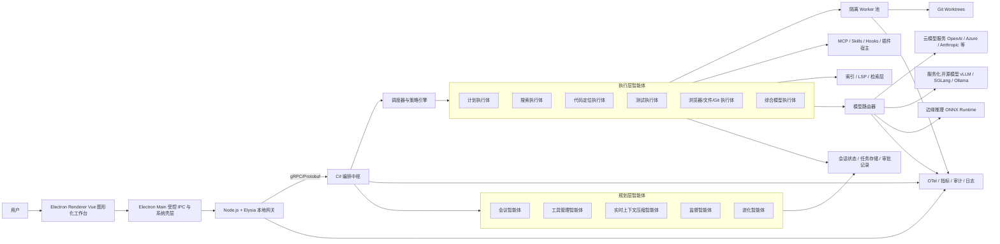

# 智能体图形化编程桌面客户端技术决策报告

## 执行摘要

基于截至 **2026 年 5 月 19 日** 的公开官方资料，你拟开发的产品方向是可行的，而且参考对象的选择基本正确：OpenAI Codex 桌面端已经明确展示了“并行线程 + worktree + 审批/沙箱 + 应用内浏览器 + 自动化任务 + 深度客户端协议”的完整桌面代理形态；Cursor 3 则把“以智能体为中心的多仓库工作区、并行 agents、Design Mode、worktree 隔离”做成了主交互范式；Claude Code Desktop 展示了“多会话、多面板、内嵌终端/文件/预览、定时任务、本地/云/SSH 运行、插件化”的完整工作台；OpenCode 和 DeepSeek TUI 则分别提供了“本地 server-first 架构、OpenAPI/SDK、MCP、OpenAI-compatible provider 接入”和“审批、上下文压缩、任务持久化、HTTP/SSE 运行时、审计日志”等可直接映射到你方案中的运行时与编排能力。换言之，你不是在赌一个全新品类，而是在把已经被多家产品验证过的能力，重新组合成一个更适合“图形化编排 + 双层智能体 + 桌面执行”的产品形态。citeturn25view0turn19view7turn25view1turn25view2turn27view6turn27view7turn27view4turn27view5turn19view8turn25view5turn25view6turn28view1turn28view2turn28view4turn28view5

对你给出的既有技术偏好——**Electron + Vue 前端、Node.js 辅助、C# 为主要 AI 后端、中间层用 elysia.js**——我的结论是：**可行，但必须收缩职责边界**。如果把 Electron、Node/Elysia、C# 三层都做成“有状态业务层”，你会在跨语言通信、协议漂移、调试复杂度、打包体积、内存占用和权限收敛上迅速失控；但如果把职责收敛为“Electron = 交互壳层与系统集成、Node/Elysia = 本地网关与插件/协议适配、C# = 智能体编排与策略中枢”，再用 **gRPC/Protobuf** 做内部主数据面、**WebSocket/SSE** 做 UI 流式事件、**JSON-RPC + capability negotiation** 做控制面，你的混合方案就会变成一种工程上非常稳妥的组合：前端体验和桌面生态保留了 Electron 的成熟度，智能体策略和多代理编排交给 C# 生态，模型与工具接入则通过网关分层实现。Electron 官方文档也明确提示其采用 Chromium 的多进程模型，必须避免阻塞 main/renderer；Elysia 官方文档提供了 Node 适配、OpenAPI、端到端类型安全；Microsoft.Extensions.AI 提供统一 AI 抽象，而微软新的 Agent Framework 则被官方定义为 Semantic Kernel/AutoGen 的直接继任方向，但 Semantic Kernel 的多代理编排文档同时明确标注相关能力仍处于实验阶段，因此必须通过你自己的领域接口做隔离。citeturn19view6turn19view5turn26view0turn26view1turn26view2turn19view12turn19view13turn27view0turn36view0turn36view1

从产品落地顺序看，最稳妥的路线不是“一上来就做全量本地多模型 + 自进化 + 三端全平台强沙箱”，而是分三阶段推进。**MVP 应该先做远程模型优先、桌面本地执行、图形化任务 DAG、严格审批、插件/MCP 接入、Git/worktree 隔离**；**Beta 再引入本地模型服务、浏览器预览/自动化、执行体并行、多仓库与 SSH/远端工作区**；**正式版再做进化智能体、安全发布流水线、评测回归、策略审计与企业管控**。尤其是你提出的“进化算法智能体自动生成 Skills/MCP/新执行体”，不应在 v1 中直接拥有“自发布代码”的能力，而应实现为一条**受监督的离线进化流水线**：观察任务模式 → 生成候选 skill/agent/plugin/prompt → 自动化测试与评测 → 人工审批 → 签名发布 → 灰度回滚。Claude Code、Codex、OpenCode 都已经把插件/skills/MCP/自动化视为一等能力，但没有任何一个成熟产品把“运行中的主代理直接修改自己的执行内核并上线”作为默认模式，这一点需要你在架构上主动收敛。citeturn19view10turn27view3turn34search5turn34search8turn25view5turn27view2

如果只给一句决策建议，那就是：**维持 Electron + Vue，但把 Node/Elysia 做薄，把 C# 做厚；MVP 以“图形化编排 + 审批/证据/审计”而不是“炫技式完全自治”为核心竞争力；本地模型推理先作为可插拔增强而不是主路径；进化能力必须走受控 CI/CD 流水线。** 这条路线在技术、性能、安全、可维护性、开发成本与合规之间的综合平衡最好。citeturn25view2turn20view3turn14search1turn19view3turn37view4

| 决策项 | 建议结论 |
|---|---|
| 总体可行性 | **高**，但前提是 Node/Elysia 仅做薄网关，C# 成为唯一智能体中枢 |
| 最优内部通信 | **gRPC/Protobuf 为主，WebSocket/SSE 为流式 UI 面，JSON-RPC 仅做控制面/能力协商** |
| 最优产品定位 | “图形化代理工作台”，不是简单把 TUI 套壳，也不是 IDE 分叉 |
| 本地模型策略 | **MVP 不强依赖本地大模型**；先上服务化模型，边缘推理只承接压缩、分类、检索辅助 |
| 进化能力策略 | **先技能合成与 Prompt 工厂，后微调/LoRA；必须经过自动测试、评测、人审、签名发布** |
| 平台优先级 | Windows + macOS 先行；Linux 作为 Beta/正式版增强，而不是 MVP 的强绑定要求 |
| 风险最高处 | 跨语言状态管理、权限与沙箱、自动更新、Linux 发行碎片、本地推理资源占用 |

## 参考对象与结论

OpenAI Codex 桌面端最值得借鉴的不是某个单独功能，而是一整套“桌面代理协议观”。官方文档显示，Codex app 已经把**并行线程、内建 worktree、Automations、Git 功能**做成桌面核心能力；其 app-server 则明确面向 rich clients，直接提供**认证、会话历史、审批、流式 agent events**；应用内浏览器则被刻意限制为**无登录、无 cookie、无扩展、无现有标签页**的受限预览环境，而涉及登录态的浏览器任务则转到 Chrome 扩展模型；安全上，Codex 默认是**网络关闭、工作区边界、OS-level sandbox + approval policy** 的组合。这一整套设计对你尤其重要，因为它几乎就是“图形化智能体桌面客户端”的参考答案：**桌面不是把 CLI/TUI 直接搬到 GUI，而是把审批、证据、预览、并行和自动化做成一等公民。**citeturn25view0turn19view7turn25view1turn25view2turn34search2turn34search3turn34search16

Cursor 3 提供的是另一条很关键的启发：**把 IDE 退到二线，把 agent workspace 作为主舞台**。官方博客与 changelog 都强调，Cursor 3 的新界面是从零开始围绕 agents 设计的，支持**多仓库、多环境、本地与云 agent 无缝切换、并行 agents、worktree 隔离、Design Mode 对浏览器中的 UI 元素直接标注**，甚至还提供 `/best-of-n` 这类并行比较策略。对你的产品来说，这意味着“图形化编排”不应只是一张节点图，而应是一套更高层的**任务图 + 结果证据 + UI 定位反馈 + 多执行体并行调度**的复合交互。citeturn27view6turn27view7turn24search1turn24search6

Claude Code Desktop 的价值在于，它证明了“桌面代理工作台”可以自然地把**会话、diff、preview、terminal、file editor、CI/PR 追踪、scheduled tasks、local/cloud/SSH 环境切换**整合到一个多面板工作区中；同时，Claude 的插件体系已经把**skills、agents、hooks、MCP servers、LSP servers、monitors**做成了清晰的扩展分类。你的双层智能体架构如果要长期演化，必须像 Claude 这样把“插件类型学”提前定义清楚，否则后续所有新增能力都会退化成不可维护的脚本集合。另一个必须注意的事实是，Claude Desktop 当前官方仍是 **macOS/Windows**，**Linux 需回到 CLI**，这也说明桌面端跨平台统一并不轻松，Linux 不能被想当然地视为和 Win/macOS 同难度。citeturn27view4turn27view5turn19view10turn27view3turn33search3

OpenCode 与 DeepSeek TUI 则更接近你要构建的“运行时骨架”。OpenCode 官方文档公开说明：运行时本身就是 **TUI + server**，server 暴露 **OpenAPI 3.1**，支持本地和远端 MCP，provider 层支持 **75+ 模型提供方** 与自定义 OpenAI-compatible provider；这说明你的桌面端完全可以采用 **client/server-in-process 或 sidecar** 的形态，而不是把所有逻辑塞进 Electron。DeepSeek TUI 的架构文档更进一步，已经展示了 **HTTP/SSE Runtime API、Persistent Task Manager、审批对话、上下文压缩、LSP 后编辑诊断、hooks、audit.log** 等关键构件；但它同时明确提示其跨平台沙箱保证是**平台相关**的，当前 **macOS Seatbelt 才是 active policy path，Linux/Windows 仍需 helper enforcement 才能视为完整 OS sandbox**。因此，你可以借鉴它的运行时和审计设计，但不能把它的沙箱状况当作桌面 GUI 产品的安全基线。citeturn19view8turn25view5turn25view6turn28view1turn28view2turn28view4turn28view5

综合这些参考对象，我建议你把产品定义为：**“一个面向代码与工具的图形化代理工作台，核心交互对象不是文件，而是任务图、证据、审批、执行体和工作区。”** 这比“做一个有聊天框的桌面 IDE”更准确，也更贴近现有一线产品的演进方向。citeturn27view6turn25view0turn27view4turn19view8

| 参考对象 | 最值得借鉴的能力 | 对你产品的直接启发 | 不建议照搬的部分 |
|---|---|---|---|
| Codex Desktop | app-server、审批/沙箱、worktree、automations、受限浏览器 | 把审批、任务事件流、浏览器预览、自动化任务做成一等架构能力 | 不要在 MVP 就做完全部 OpenAI 式云账户体系 |
| Cursor 3 | agents-first 工作区、并行 agents、Design Mode、worktree 隔离 | 图形化视图应表达任务依赖、并行和 UI 精确反馈，而不是只画流程图 | 不要在早期就上“best-of-n”默认并行，成本太高 |
| Claude Code Desktop | 多会话多面板、local/cloud/SSH、scheduled tasks、插件分类 | 你的桌面 IA 应采用“概览图 + 会话细节 + diff/证据面板”三层结构 | 不要把所有插件类型混成单一 script 插件 |
| OpenCode | server-first、本地 OpenAPI 3.1、MCP、多 provider | 桌面产品可采用本地 sidecar server，协议先行、UI 后置 | 不要只保留 TUI 思维；GUI 必须强化证据和审批 |
| DeepSeek TUI | 持久任务、审批、压缩、hooks、审计、LSP 后诊断 | 运行时、审计点、上下文压缩可以直接借鉴 | 不要把其跨平台沙箱能力当作最终安全基线 |

## 推荐总体架构

你的混合方案之所以“可行但危险”，根源在于 **Electron、Node/Elysia、C#** 三层都很容易天然长业务状态。Electron 官方明确说明其沿用 Chromium 的**多进程架构**；同时，性能文档反复强调不要阻塞 main/renderer，要尽量 bundle、尽量延后加载、尽量减少不必要网络与 polyfill。Elysia 目前官方文档已经给出 Node 适配、OpenAPI 与端到端类型安全，但其官方博客在 Node adapter 发展过程中曾明确提到 Node adapter 的 beta 状态；微软侧 Microsoft.Extensions.AI 已提供统一抽象，而 Agent Framework 虽被定位为 Semantic Kernel/AutoGen 的继任方向，但 Semantic Kernel 的 Agent Orchestration 页面仍明确标记实验阶段。这些信息放在一起，结论非常明确：**你不能把三层都做成产品真相源（source of truth）；只能有一层是“业务大脑”。**citeturn19view6turn19view5turn26view0turn26view1turn26view2turn26view3turn19view12turn19view13turn27view0

我建议把 **C# 编排层** 设为唯一智能体真相源，把 **Node/Elysia** 限定为本地网关、插件/协议适配层，把 **Electron** 限定为 UI 和受控原生能力壳层。内部协议上，推荐 **gRPC/Protobuf** 作为 Node↔C# 的主数据面：微软官方文档给出的结论很清楚，gRPC 在 HTTP/2 + Protobuf 下适合低延迟、高吞吐、跨语言同步通信，并天然支持严格 contract、双向流、代码生成与 deadline/cancellation；面向桌面 UI 的 token/event 流则用 **WebSocket 或 SSE**；而控制面与实验特性协商，则借鉴 Codex app-server 的 **initialize + capabilities** 模式，用 JSON-RPC 做低频控制。这样做的好处是：高频热路径不用 JSON 自由漂移，新增能力又能通过 capability 协商灰度发布。citeturn36view0turn36view1turn19view14turn19view7turn21view1

在 C# AI 栈选择上，建议明确分层。**Microsoft.Extensions.AI** 应作为最底层模型/嵌入/工具抽象，因为它的目标就是在 .NET 应用中统一不同 AI 服务的表示与互操作；**Semantic Kernel** 适合作为 prompt、plugin、function calling、记忆与 Agent 模式的实用层；而**Agent Framework** 则作为未来的多代理编排承载层进行封装试点，但不要把桌面产品的业务协议直接绑死在某个实验性 agent API 上。换句话说，你要依赖的是**你自己的 IPlanner / IScheduler / IExecutionAgent / IPolicyGuard 接口**，而不是直接把某个框架的类图暴露到整个系统。citeturn19view12turn19view13turn27view1turn27view0

下图给出我建议的落地架构。它不是“参考对象的复制品”，而是把 Codex 的审批/浏览器/应用协议、Cursor 的并行工作区、Claude 的多面板与插件类型、OpenCode 的 server-first、本地 OpenAPI，以及 DeepSeek 的任务管理和上下文压缩，合并成一套适合你双层智能体设计的形态。citeturn25view0turn25view1turn27view6turn27view4turn19view8turn28view1turn28view5



按照这个总图，桌面交互层建议采用**三层式信息架构**，而不是单一聊天窗口。第一层是**任务/项目/会话概览层**，用图形化 DAG 展示“任务拆解、依赖、执行体、审批点、证据节点”；第二层是**会话工作层**，用多面板承载聊天、计划、diff、文件、终端、浏览器预览；第三层是**证据与审计层**，展示 tool call、模型响应、上下文压缩前后对照、审批决策和回放。这种 IA 比“把 TUI 改成按钮”和“做一个 VS Code 克隆”都更接近用户真正需要的管理面。citeturn27view4turn27view7turn25view1turn34search19

下面给出几种替代方案的工程判断。这里的“优缺点”是针对**你的目标产品**而言，而不是抽象地评价技术本身。

| 方案 | 优点 | 缺点 | 适用场景 |
|---|---|---|---|
| **Electron + Vue + Node/Elysia + C#** | 最符合你当前偏好；桌面 UI 成熟；前后端边界清晰；利于快速做复杂工作台 | 多语言通信与调试复杂；包体和内存较大；权限边界需要严格治理 | **推荐主方案**，尤其适合需要快速验证复杂桌面交互 |
| **Electron + Vue + C# 直连，弱化 Elysia** | 降低一层中间复杂度；减少协议漂移 | 插件生态与 TS 侧开发体验变差；前端/协议联动不如 Elysia 方便 | 如果后续发现 Node/Elysia 成本过高，可作为收缩方案 |
| **Electron + Vue + Rust Sidecar + C# Orchestrator** | 把高频、CPU 密集、原生调用交给 Rust；显著改善性能热点 | 语言再增一层；构建、签名、CI 更复杂 | 适合 Beta 后期，针对性能瓶颈做定点优化 |
| **Tauri + Vue + Rust + C#** | 官方强调 tiny/fast，因使用 OS WebView，包体通常更小；消息传递模型清晰 | 不同 OS WebView 差异会带来 UI 一致性与调试成本； Electron 生态更成熟 | 如果你把“包体更小、资源更省”放在第一优先级，可评估为第二代架构 |
| **Electron + Vue + Node-only** | 初期开发最快，团队学习曲线最低 | 多代理编排、评测、强类型和复杂策略维护会更痛苦 | 仅适合非常短期 MVP，不建议作为长期主架构 |
| **纯服务化桌面薄壳** | 客户端轻；运维与安全集中 | 离线能力弱；本地工具/文件系统/浏览器控制体验打折 | 适合强 SaaS、弱本地执行的产品，不适合你当前目标 |

## 模块与接口

你给出的双层智能体设计可以非常自然地落到一套**“规划层负责决策与约束，执行层负责可验证动作”** 的架构上。我的建议是：**会议智能体** 只负责把用户意图转换为任务 DAG 与成功标准；**工具管理智能体** 负责给每个节点装配合适的工具集、模型集和权限边界；**实时上下文压缩智能体** 在每个阶段检查 token 预算、证据密度与摘要可逆性；**监督智能体** 全程持有“预算、权限、质量、时间”四类闸门；**进化智能体** 不进入热路径执行，而是旁路观察与生成候选能力。执行层则拆成若干“可度量执行体”：计划执行体、搜索执行体、代码定位执行体、测试执行体、浏览器/文件/Git 执行体、综合模型执行体。这样可以保证每个执行体都可以单测、回放、评估和替换，而不会变成一个不可解释的“超级代理”。微软的 Agent Framework 与 Semantic Kernel 都支持多代理协作，Cursor/Codex 则证明了 worktree 与并行任务对编程代理尤其重要，Git 官方文档也明确 worktree 是同仓库多工作树并行作业的正统能力。citeturn27view1turn27view0turn27view7turn34search3turn24search6

调度策略上，推荐使用 **DAG + 优先队列 + 预算约束**。会议智能体把用户请求切成可执行节点后，调度器按四个原则运行：其一，**依赖先决**，未满足前置证据的节点不得启动；其二，**隔离优先**，凡是可能改动代码、安装依赖、执行测试或访问网络的节点，都默认运行在独立 worktree / sandbox worker 中；其三，**预算治理**，每个节点都绑定 token、时长、成本与权限预算；其四，**证据回传**，任何执行体都必须产出结构化步骤结果与可审阅证据，而不是只回一句自然语言结论。DeepSeek TUI 的持久任务、审批与 replayable event timeline，Codex/Cursor 的 worktree 与并行模式，都表明：**代理编程产品最终比拼的不是“会不会生成代码”，而是“能不能把执行过程组织成可治理的工程系统”。**citeturn28view5turn28view2turn34search3turn27view7

下表是建议的模块边界与接口约定。它是一个**可执行的产品骨架**，并且刻意把跨语言复杂度限制在少数稳定接口上。

| 模块 | 主要职责 | 关键 API / 通道 | 消息格式 | 认证/加密 | 错误码建议 | 版本兼容策略 |
|---|---|---|---|---|---|---|
| Electron Renderer Vue | 图形化 DAG、会话面板、审批 UI、diff/preview/日志展示 | `window.agentBridge.*` 受控 IPC | JSON event envelope | 不持有主密钥；仅接收短期 session token | `UI_4xxx` | 仅消费向后兼容字段；未知字段忽略 |
| Electron Main | 受控系统壳层、BrowserView、文件选择、剪贴板、通知、更新 | IPC + 本地网关握手 | JSON | 启动时生成一次性 nonce；敏感操作白名单 | `IPC_4xxx` | IPC channel 以 major version 分 namespace |
| Node/Elysia 本地网关 | UI 网关、OpenAPI 暴露、前端 SDK、插件适配、流式转发 | REST/OpenAPI、WS/SSE、gRPC client | JSON 对外 / Protobuf 对内 | 本地 UDS/Named Pipe 优先；127.0.0.1 仅回退；本地 mTLS 可选 | `GW_4xxx` | OpenAPI additive minor；移除字段需 major |
| C# 编排中枢 | 会话状态、任务 DAG、策略、调度、代理生命周期 | gRPC service | Protobuf | 服务鉴权 token + 进程级 ACL | `ORCH_4xxx` | Proto field 只增不删，废弃字段保留 reserved |
| 会议智能体 | 对话拆解为任务节点、成功标准与审批点 | `CreatePlan`, `RevisePlan` | `TaskGraph` | 继承会话权限，不直接拿系统权限 | `PLAN_42xx` | `TaskGraph.schema_version` + capability flags |
| 工具管理智能体 | 给节点分配工具、模型、权限、执行环境 | `ResolveToolkit`, `ResolveModelRoute` | `ToolPolicy`, `ModelRoute` | 基于 project policy 与 user policy 双重判断 | `TOOL_43xx` | Tool schema 采用 semver；破坏性变更需新 tool id |
| 实时上下文压缩智能体 | 维护工作上下文、摘要、可逆证据包 | `CompactContext`, `ExpandEvidence` | `ContextPack` | 仅访问会话证据层，不直接访问系统工具 | `CTX_42xx` | 摘要算法可灰度，`pack_version` 必填 |
| 监督智能体 | 审批、预算、风险评分、停止/回滚 | `Authorize`, `AbortRun`, `RaiseAlert` | `ApprovalRequest/Decision` | 必须有审计日志 | `SAFE_40xx` | 拒绝未知高风险动作；默认 deny |
| 执行体 Worker | 搜索、定位、测试、文件/Git/浏览器操作 | `RunStep`, `StreamStepEvents` | `ExecutionStep`, `StepResult` | worker 内临时 token；最小权限 | `EXEC_45xx` | 执行体接口稳定，内部实现可替换 |
| MCP / Skills / Hooks 宿主 | 外部工具扩展、脚本、知识包、生命周期钩子 | stdio / remote MCP / hook callbacks | MCP JSON-RPC + local manifests | 本地工具优先 stdio；远端 host allowlist | `EXT_46xx` | 插件 manifest major/minor；能力协商 |
| 模型路由器 | 根据任务类型、预算、隐私级别选择模型 | `RouteChat`, `RouteEmbed`, `RouteEval` | `ModelRequest`, `ModelResponse` | provider credential 仅存 OS keychain/keyring | `MODEL_47xx` | provider adapter 独立 version，接口稳定 |
| 观测与审计 | trace、metric、log、approval、security audit | OTel + JSONL Audit | OTel spans / append-only audit records | 脱敏导出；提示词记录默认关闭 | `OBS_48xx` | 新审计字段只增不删 |

为避免协议漂移，我建议系统内一律使用统一消息信封。下面是推荐的事件消息契约示意。它借鉴了 Codex app-server 的 capability 协商思路，也与 OpenCode 的 server-first、本地 API 化设计一致。citeturn19view7turn21view1turn19view8

```json
{
  "schema_version": "1.0",
  "capabilities": ["plan.dag", "step.stream", "approval.v2", "context.pack.v1"],
  "trace_id": "01JV...XYZ",
  "session_id": "sess_...",
  "task_id": "task_...",
  "agent_id": "planner.meeting",
  "event": "step.dispatch",
  "ts": "2026-05-19T10:32:45.123+09:00",
  "idempotency_key": "a7d1...",
  "payload": {},
  "security": {
    "policy_scope": "workspace",
    "risk_level": "medium",
    "requires_approval": true
  }
}
```

围绕这套 envelope，建议把消息契约固定为下表这样的“有限事件集”，避免一次次为临时功能发明新格式。

| 事件名 | 发送方 | 接收方 | 用途 | 必填字段 |
|---|---|---|---|---|
| `task.create` | Renderer / 会议智能体 | 编排中枢 | 创建任务 | `session_id`, `user_goal`, `workspace_ref` |
| `plan.draft` | 会议智能体 | Renderer / 监督智能体 | 输出任务 DAG 草案 | `task_graph`, `success_criteria` |
| `step.dispatch` | 调度器 | 执行体 | 派发步骤 | `step_id`, `executor_type`, `sandbox_profile`, `budget` |
| `approval.request` | 执行体 / 监督智能体 | Renderer | 请求审批 | `action`, `risk_level`, `reason`, `affected_paths` |
| `approval.decision` | Renderer / 用户 | 监督智能体 | 返回审批结果 | `request_id`, `decision`, `ttl` |
| `step.result` | 执行体 | 调度器 / Renderer | 返回结构化结果 | `status`, `artifacts`, `evidence_refs`, `cost` |
| `context.compact` | 压缩智能体 | 编排中枢 / Renderer | 产出压缩包 | `pack_id`, `compression_ratio`, `evidence_map` |
| `alert.raise` | 监督智能体 | Renderer / 审计 | 风险、预算、失败告警 | `alert_type`, `severity`, `cause` |
| `evolution.propose` | 进化智能体 | 监督智能体 / CI | 提出新 skill / agent | `candidate_spec`, `source_patterns`, `test_plan` |
| `plugin.publish` | CI / 人审 | 插件宿主 | 发布签名产物 | `artifact_id`, `signature`, `rollback_to` |

你新增的“进化智能体”必须单独说明，因为它既最有潜力，也最危险。我的建议是：**默认先做 Prompt 工厂 + Skill 合成 + Hook/MCP 封装，不直接做在线微调**。Claude 的插件体系已经把 skills/agents/hooks/MCP/LSP/monitors 划分清楚；Codex 文档明确说明 skills 是可复用工作流的作者格式，plugins 是安装分发单元；Microsoft.Extensions.AI.Evaluation 则已经提供了质量与安全评测库。把这些拼起来，你可以做出一条很稳健的进化流水线：观察高频任务模式 → 抽取输入/输出/约束 → 生成候选 skill/agent/plugin spec → 在隔离仓库与黄金样例上回放 → 跑单测/集成测试/评测 → 人工审批 → 签名打包 → 灰度发布。只有当你拥有稳定、合规、匿名化的数据闭环后，再考虑 LoRA/小模型微调。citeturn19view10turn27view3turn34search8turn34search5turn27view2

| 进化阶段 | 输入 | 产物 | 自动门槛 | 人工门槛 |
|---|---|---|---|---|
| 模式观察 | 任务日志、审批记录、失败原因、重复步骤 | 高频模式清单 | 去重率、复现率达标 | 无 |
| 候选合成 | 模式清单、样例仓库、tool schema | Prompt 模板 / Skill / Hook / MCP 封装 / 新执行体定义 | schema 校验通过 | 无 |
| 自动验证 | 黄金仓库、回归任务、策略规则 | 测试报告、评测结果、资源消耗报告 | 单测/集成/安全评测通过 | 无 |
| 安全审查 | 候选产物、日志、权限需求 | 审核结论 | 无 | 权限范围、潜在破坏性、依赖来源通过 |
| 签名发布 | 审核通过产物 | 已签名插件/执行体包 | 签名、清单、回滚元数据完整 | 发布批准 |
| 灰度与回滚 | 线上低流量/内测用户 | 版本采纳结果 | 指标不达标自动回滚 | 全量发布批准 |

最后，权限与沙箱必须是“随消息走”的，而不是“随模块猜”的。浏览器预览任务、脚本执行、安装依赖、写文件、Git push、消费真实账号 cookies、连接远端 MCP、调用企业私有模型，这些都必须在消息层携带 `risk_level`、`policy_scope`、`requires_approval` 等字段，才能做到真正可审计。Codex 的做法——默认网络关闭、工作区边界、浏览器登录态隔离——在这里值得直接复用。citeturn25view2turn25view1

## 性能、部署与工程化

性能上要先认清一个事实：**你的产品不是“一个窗口 + 一个模型接口”，而是“Chromium 多进程桌面壳 + 本地 gateway + C# 编排 + 工具 worker + 可能的浏览器预览 + 可能的本地模型服务”**。Electron 官方已经给出两个最关键提醒：它是 Chromium 风格的**多进程架构**，并且性能优化重点包括**不要阻塞 main process / renderer process、尽量 bundle、尽量延后加载、先测量再优化**。因此，最容易出问题的热点不会是单次 LLM 请求本身，而是：渲染面板过多、预览页/BrowserView 过多、Node 与 C# 间重复 JSON 序列化、仓库索引与上下文压缩抢 CPU、以及本地模型服务与桌面 UI 抢内存。citeturn19view6turn19view5

从通信与推理形态看，建议你在性能策略上做三条明确分层。第一，**内部同步通信走 gRPC**：微软官方文档已经明确给出其在低延迟、高吞吐、跨语言、双向流、严格 contract、deadline 传播上的优势；如果你继续用 JSON over HTTP 作为 Node↔C# 主通道，热路径会变得又慢又难治理。第二，**本地/边缘推理只承担短任务**：ONNX Runtime 的 generate() API 当前仍是 preview，更适合小模型的摘要、压缩、分类与轻推理加速，而不适合在 v1 就承担主推理。第三，**主模型推理优先服务化**：vLLM 官方强调高吞吐、PagedAttention、continuous batching、OpenAI-compatible API 与 gRPC 支持；SGLang 官方文档也明确支持 OpenAI-compatible API、广泛硬件与 TTFT/TPOT/ITL 基准工具；Ollama 的优势是开发与离线接入门槛低、官方 JS 库可用、且支持 OpenAI Responses API，但其官方文档也明确说明 Responses 兼容是 **non-stateful**，不应把它当成复杂会话编排的唯一主后端。citeturn36view0turn36view1turn19view15turn30view0turn29view8turn32search1turn32search12turn29view6turn29view7

基于这些前提，在**硬件规格未指定**的情况下，我建议以下性能目标作为产品评审的工程基线。这些不是官方基准，而是针对“桌面代理工作台”形态给出的**实现目标**。

| 指标 | MVP 目标 | Beta 目标 | 正式版目标 | 说明 |
|---|---:|---:|---:|---|
| 冷启动到首屏可交互 | ≤ 2.5s | ≤ 2.0s | ≤ 1.8s | 不含本地模型拉起 |
| 打开项目到首个会话可用 | ≤ 3.5s | ≤ 2.5s | ≤ 2.0s | 含基础索引与工作区检查 |
| 云模型 TTFT | ≤ 1.8s | ≤ 1.3s | ≤ 1.0s | 首 token 到达桌面 UI |
| 本地模型 TTFT | ≤ 3.0s | ≤ 2.2s | ≤ 1.8s | 仅针对小/中模型服务 |
| UI 空闲内存 | 250–450MB | 220–400MB | 200–350MB | 取决于面板数量与预加载策略 |
| 工作态内存 | 600MB–1.2GB | 500MB–1.0GB | 450–900MB | 含 diff/terminal/preview/2–3 执行体 |
| 本地网关 hop 延迟 | ≤ 50ms | ≤ 30ms | ≤ 20ms | Node↔C# 往返，不含模型耗时 |
| 单节点调度开销 | ≤ 120ms | ≤ 80ms | ≤ 50ms | 仅指编排与派发 |
| 上下文压缩耗时 | ≤ 500ms | ≤ 350ms | ≤ 250ms | 以 50k–100k token 工作集为基准 |
| 包体大小 | 150–280MB | 150–260MB | 140–240MB | Electron 主方案；Tauri 可更小 |
| 并行执行体数 | 2 | 4 | 6–8 | 需受预算/核数/内存门控 |

性能测试方面，不要只做“接口压测”，而要做**整链路桌面基准**。Playwright 已提供 Electron 自动化支持；BenchmarkDotNet 适合 C# 的可复现实验；k6 官方文档既支持浏览器侧指标，也支持 gRPC 压测；SGLang 文档明确把 **TTFT、TPOT、ITL、吞吐**作为服务基准指标。这意味着你完全可以建立一套贯穿 UI、网关、编排、模型服务的统一基准系统。citeturn30view5turn30view4turn30view6turn5search11turn32search12

| 测试类别 | 典型用例 | 核心指标 | 推荐工具 | 数据采集方法 |
|---|---|---|---|---|
| 桌面启动 | 冷启动、热启动、打开最近项目 | 可交互时间、内存峰值、CPU 峰值 | Playwright Electron | 每种场景 30 次，取中位数/P95 |
| 编排性能 | 会议智能体生成 DAG、监督审批、节点并发调度 | 调度开销、队列等待、取消传播耗时 | BenchmarkDotNet + 自定义 harness | 固定任务图规模，比较 10/50/100 节点 |
| 网关通信 | Renderer→Elysia→C# 双向流事件 | RTT、吞吐、流中断恢复 | k6 gRPC / WS 压测 | 固定 payload 尺寸和并发数 |
| 代码执行 | 搜索、定位、patch、测试、Git worktree | 单步成功率、耗时、回滚成功率 | 自研回放器 + CI Runner | 黄金仓库 + 失败注入 |
| 本地模型服务 | 压缩、摘要、代码修复、检索辅助 | TTFT、TPOT、ITL、显存/内存 | SGLang bench / 自研 client | 固定上下文长度与输出长度 |
| 浏览器验证 | 本地预览页定位、注释、截图、修复回归 | 页面加载、交互耗时、截图成功率 | Playwright | 录制标准化场景 |
| 稳定性 | 连续 2h / 8h 工作、异常断连、更新后恢复 | 崩溃率、会话恢复率、数据一致性 | soak test + crash dump | 分平台长时间运行 |
| 用户体验 | 批准路径、并行会话切换、图形 DAG 可理解性 | 操作步数、误触率、完成时间 | 可用性测试 | 5–10 名目标用户任务观察 |

部署与自动更新上，**Electron 主方案** 的建议是使用 **Electron Forge** 作为默认打包分发主链路。Forge 官方文档已经明确，它是 all-in-one 的 packaging/distribution 流水线，涵盖 code signing、installers、artifact publishing；其自动更新文档也明确指出，macOS 自动更新的前提是**签名应用**。同时，Electron 官方代码签名文档明确说明，**Windows 与 macOS 都会阻止用户直接运行未签名应用**。如果你改走 Tauri，则其官方 updater 插件支持**动态更新服务**与**静态 JSON 清单**两种模式，并且带签名校验字段，这对未来做灰度与多渠道非常友好。citeturn29view4turn29view5turn29view3turn29view2

macOS 还需要特别注意公证。Apple 官方文档明确指出：自 macOS 10.15 起，**使用 Developer ID 分发的软件需要进行 notarization**；Developer ID 页面也强调，公证服务会对已签名软件执行自动扫描并为 Gatekeeper 提供信任票据。因此，正式版 macOS 分发你必须把 **Developer ID 签名 + notarization** 做进 CI/CD，而不是发布前手工操作。citeturn31search0turn31search5

跨平台发布矩阵本身也会带来真实工程成本。官方资料显示：Codex app 当前是 **macOS/Windows**；Claude Desktop 也是 **macOS/Windows，Linux 需使用 CLI**；而 Cursor 与 OpenCode 已分别展示了更完整的跨平台下载矩阵，其中 OpenCode 桌面版甚至给出了 **Windows、macOS、Linux 的 .deb/.rpm/.AppImage** 组合。你的产品如果一开始就承诺 Windows/macOS/Linux 完整一等公民支持，交付压力会显著高于只做 Win/macOS。citeturn25view0turn33search3turn24search7turn7search4

| 平台 | 建议打包形态 | 自动更新建议 | 关键注意点 |
|---|---|---|---|
| Windows | NSIS/MSI 或 user/system installer | 自建更新服务 + 分渠道发布 | 安装目录权限、杀软误报、系统级与用户级差异 |
| macOS | DMG + zip | 签名后自动更新，必须纳入 notarization 流水线 | Intel/Apple Silicon、Gatekeeper、权限弹窗 |
| Linux | AppImage + `.deb` 先行，`.rpm` 次之 | 以 AppImage/自管清单为主，包管理器更新为补充 | 发行版碎片、桌面环境差异、lib 依赖 |
| 企业私有化 | 离线包 + 内网更新镜像 | 分层灰度，支持 rollback manifest | 证书、离线签名、审计留存 |
| 云模型服务 | Docker Compose 起步，后续再容器编排升级 | API 版本冻结 + 蓝绿/金丝雀 | 模型权重、GPU 资源、成本回收 |

CI/CD 建议采用 **GitHub Actions matrix + OIDC**。GitHub 官方文档给出的最佳实践很清楚：matrix 适合一次工作流跑多 OS/多架构组合，而 OIDC 可直接换取云厂商短期凭证，避免长期 secrets 常驻仓库；对于本地模型服务、OTel Collector、向量库或测试依赖，则建议用 **Docker Compose** 管理本地和 CI 的多容器栈。citeturn30view1turn30view2turn30view3

## 安全、合规与运维

安全基线必须从 Electron 开始收紧，而不是等产品做大后再补。Electron 官方安全文档给出的建议非常明确：**不要对远程内容开启 Node integration；开启 contextIsolation；开启 process sandboxing；不要关闭 webSecurity；不要把 shell.openExternal 用在不可信输入上；校验 IPC sender；避免把 Electron API 暴露给不可信 Web 内容；尽量不要依赖 file://，而应考虑自定义协议。** 这些要求对你的产品尤其重要，因为它会同时涉及聊天富文本、应用内浏览器、插件、MCP、外部链接、文件系统和潜在的浏览器自动化。任何一个口子松掉，桌面壳层都会变成整个系统最脆弱的入口。citeturn20view1turn20view2turn20view3turn20view4turn20view5

智能体执行侧的安全模型，建议直接采用“**默认拒绝 + 分层审批 + 最小权限沙箱**”。Codex 的官方安全文档已经给出很好的产品化参照：本地默认网络关闭、工作区范围限制、OS-enforced sandbox 与 approval policy 叠加；Windows 侧还有专门的 sandbox 模式说明。你自己的实现可以分三档：**只读档**（检索/索引/解释）、**工作区写档**（改单测/生成补丁/本地编辑）、**升级档**（联网、安装依赖、Git push、使用真实浏览器登录态、访问企业内部系统）。其中升级档必须显式审批，且必须带 TTL、理由和审计记录。DeepSeek TUI 文档已经提醒你，跨平台沙箱保证不是天然一致的，因此 Windows/Linux 上不要轻信“看起来隔离了”就等于真的安全，必要时应把高风险执行移到容器、受控 VM、远端 runner 或企业托管执行环境中。citeturn25view2turn25view4turn28view2turn28view4

浏览器能力需要单独隔离。Codex 的应用内浏览器文档明确说明：它不支持身份认证流、登录页面、常规浏览器 profile、cookies、扩展与现有标签页，并要求把页面视为不可信上下文；需要登录态时，转用 Chrome 扩展。这个分层非常值得照搬，因为它天然把“预览”和“真实账号操作”拆开了。你产品里的浏览器执行体也应如此：**默认只允许无登录态的 localhost/public 页面预览与注释；凡是需要真实会话的企业系统，一律切外部受控浏览器通道，并做域名 allowlist。**citeturn25view1turn34search16

数据隐私与合规方面，如果你的产品面向中国用户或处理中国境内个人信息，就必须按 **PIPL** 建模。中国网信网发布的《个人信息保护法》明确规定了处理个人信息的合法性基础、告知义务、撤回同意、个人权利；对跨境提供个人信息，第三十八条、第三十九条、第四十条分别规定了安全评估/认证/标准合同、单独同意、以及特定情形下境内存储与安全评估要求；第五十一条、第五十五条、第五十四条则要求采取加密、去标识化、权限管控、应急预案、影响评估与合规审计。2024 年《促进和规范数据跨境流动规定》又进一步细化了数据出境制度的适用边界。对你这种会收集**代码、对话、日志、截图、浏览器证据、可能的账号上下文**的产品来说，这意味着不能只做“有个隐私政策”，而必须把**本地优先、最小采集、明确告知、单独同意、分级留存、跨境门控、删除导出能力**做进产品。citeturn37view5turn37view3turn37view4turn19view1

GDPR 侧同样不能忽视。EU 官方法规与多家监管资料都强调，对个人数据处理必须满足合法性、透明度与安全要求；Article 32 明确要求结合技术现状、实施成本与风险采取适当技术与组织措施；EDPB 在 2025 年发布的 LLM 隐私风险与缓解报告，则专门提出了针对 LLM 系统的系统化风险识别、评估与缓解方法。换到你的产品语境中，最关键的不是“有没有欧洲用户”，而是**用户代码、提交作者、注释、日志、截图、浏览器内容、日历/工单/Slack/GitHub 集成是否落入个人数据范围**。如果是，就必须把“privacy by design”当作架构约束，而不是法务附件。citeturn19view2turn39search3turn19view3turn39search14turn39search2

我建议你把隐私控制至少落实到下表这些点上：

| 控制项 | 建议做法 |
|---|---|
| 默认数据路径 | **本地优先**：索引、摘要、中间工件默认留在本机；任何云上传显式可见 |
| 采集最小化 | 把数据分为代码、提示词、日志、截图、浏览器证据、模型评测数据六类，按类控制 |
| 敏感字段脱敏 | 用户提示词、文件路径、token、cookie、账号、IP、邮箱默认脱敏后再进日志/遥测 |
| 模型训练使用 | 默认关闭；如用于改进模型或进化流水线，必须显式告知与可撤回 |
| 跨境控制 | 境内与境外环境分域部署；跨境前做数据分类与场景判断 |
| 权利响应 | 提供会话导出、删除、停用遥测、清除本地索引与凭证的一键入口 |
| 保留策略 | 原始提示词、截图、审批记录、审计日志分别设置保留期，不可一刀切 |
| 影响评估 | 浏览器自动化、账号接管、企业系统集成、用户行为分析上线前必须做 PIA / PIPIA |

运维与日志建议采用“**观测日志**”与“**审计日志**”双轨制。OpenTelemetry 官方定义了统一的 traces、metrics、logs 观测框架，而且明确把后端存储/可视化与采集框架分离；Codex 的高级配置文档已经展示了 OTel 导出思路，并且默认关闭用户提示词日志；DeepSeek TUI 的架构文档则给出了 hooks、stdout/jsonl/webhook，以及 append-only 的 audit.log 作为审批/提权动作落点。对你来说，最合理的落地方式是：**OTel 用于性能、可靠性与调试；append-only audit 用于合规、安全与争议追踪。** 两者不要混用。citeturn30view7turn30view8turn14search1turn28view4turn28view2

| 观测/审计点 | 必记字段 | 触发条件 | 处理建议 |
|---|---|---|---|
| 会话启动 | session_id、workspace、user、policy profile | 打开项目/新建会话 | 进入 trace 根 span |
| 任务拆解 | task_graph hash、planner version | plan 生成/重写 | 保存可回放 DAG |
| 审批请求 | action、risk、reason、TTL、affected paths | 任意高风险动作 | 写 append-only audit |
| 提权执行 | before/after 权限、命令摘要 | 网络/安装/外部系统访问 | 强审计 + 告警 |
| 上下文压缩 | pack_id、ratio、evidence map | 触发压缩 | 保留压缩前后摘要 hash |
| 模型调用 | model、provider、tokens、TTFT、成本 | 每次请求 | 提示词内容默认脱敏/关闭 |
| 工具调用失败 | tool、stderr 摘要、return code | 任意失败 | 自动聚合进错误看板 |
| 插件/执行体发布 | artifact、signature、reviewer | 进化流水线发布 | 必须可回滚 |
| 自动更新 | 版本、渠道、签名校验结果 | 更新时 | 与 crash/rollback 关联 |

## 里程碑、成本与风险

在“约束未指定”的前提下，我建议把项目拆成 **MVP、Beta、正式版** 三段，每段都以“产品可验证能力”而不是“技术完成度”作为验收标准。最忌讳的是前两个月都在做基础设施、三个月后仍然没有一条能让评审人员亲手体验的完整工作流。你的产品真正需要最早验证的，是：**图形化任务 DAG 是否比纯聊天更好用；审批/证据/回放是否真能提升信任；双层智能体是否比单代理更稳定；worktree + 执行体并行是否真能提高效率。** 这些验证完成后，再扩大到本地模型、插件生态和进化能力。citeturn25view0turn27view7turn27view4turn28view5

| 阶段 | 时间估算 | 建议人员配置 | 关键任务 | 阶段验收 |
|---|---:|---|---|---|
| MVP | 10–12 周 | Tech Lead/架构 1；Electron/Vue 2；C#/AI 2；Node/Gateway 1；QA 1；UX 0.5 | 图形化 DAG、会话面板、审批 UI、Elysia 网关、C# 编排中枢、搜索/定位/测试/文件/Git 基础执行体、worktree 隔离、云模型接入、基本审计 | 用户可完成“需求 → 任务拆解 → 修改 → 测试 → 审批 → 提交”的单端闭环 |
| Beta | 10–14 周 | 在 MVP 基础上增加 SRE/DevOps 1、Native/性能工程 1（可兼职） | 多执行体并发、浏览器预览、MCP/Skills、SSH/远端工作区、本地模型可插拔、上下文压缩、自动化任务、稳定性与基准体系 | 用户可在真实仓库里持续使用，具备多会话/多仓库/基础插件能力 |
| 正式版 | 8–12 周 | 保持 7–9 人核心团队，补安全/合规支持 | 进化流水线、插件签名与灰度、企业策略中心、跨境与隐私控制、升级回滚、Linux 增强、全链路可观测 | 支持团队级部署、可审计、可灰度、可回滚、可合规交付 |

从开发成本上看，这个混合方案**不是最低成本方案**，但它是“体验/控制力/长期演进”平衡最好的方案。若以同等目标复杂度对比，**Electron + Node-only** 确实会更快出 demo，但会在复杂策略、评测与稳定编排上付出更大后期维护成本；**Tauri + Rust** 会在资源占用上更漂亮，但在第一代产品里通常会增加 UI 一致性与原生工程复杂度。你现有偏好栈的最佳做法不是推翻重来，而是尽量把复杂性“压缩到少数边界处”——也就是：**一份 Proto、一份 OpenAPI、一套事件信封、一套策略模型、一套审计模型。** 只要这几件事先立住，语言多样性仍然是可控的。citeturn29view0turn29view1turn11search8turn19view12turn36view0

推荐优先采用的第三方组件与工程基础设施如下。这里我刻意只列“高价值且与你目标最相关”的少数项，而不是罗列一整页生态名词。

| 领域 | 推荐方案 | 选择理由 |
|---|---|---|
| 桌面壳层 | **Electron + Electron Forge** | 当前与你偏好最一致；打包、签名、发布、更新链路成熟 |
| 网关层 | **Elysia + OpenAPI + Eden** | TS 侧开发效率高；前后端类型联动方便 |
| AI 抽象层 | **Microsoft.Extensions.AI** | 统一模型/嵌入/评测抽象 |
| 编排层 | **Semantic Kernel 核心 + 自定义 orchestrator 接口** | 保持灵活，避免被实验性 orchestration API 绑定 |
| 内部通信 | **gRPC/Protobuf** | 强 contract、跨语言代码生成、流式与 deadline 更适合热路径 |
| 插件标准 | **MCP + Skills + Hooks** | 与当前主流代理生态对齐，利于生态互通 |
| 模型服务 | **vLLM / SGLang / Ollama / ONNX Runtime** 分层使用 | 分别承接高吞吐服务化、广硬件支持、开发离线、本地小模型 |
| 测试 | **Playwright Electron + BenchmarkDotNet + k6** | 覆盖桌面 UI、C# 热点、协议压测三类核心场景 |
| 可观测 | **OpenTelemetry + JSONL Audit** | 调试与合规分轨 |
| CI/CD | **GitHub Actions Matrix + OIDC + Docker Compose** | 多平台构建、安全发版、开发/测试环境一致性 |

最后给出一份按**概率 × 影响**排序的风险清单。这些风险比“模型效果是否绝对最好”更值得在立项阶段讨论。

| 风险 | 概率 | 影响 | 说明 | 缓解措施 |
|---|---|---|---|---|
| 跨语言状态漂移 | 高 | 高 | Electron/Node/C# 都保状态会导致调试噩梦 | 只允许 C# 持业务真相；统一 Proto/OpenAPI/Event envelope |
| Electron 资源占用偏高 | 高 | 高 | 多窗格、预览、浏览器、索引、本地模型叠加 | 懒加载、worker 隔离、远程模型优先、性能预算与基准门禁 |
| Linux 发布时间被低估 | 高 | 中高 | 发行版/包格式/依赖差异大 | Win/macOS 先行；Linux Beta 起；优先 AppImage + `.deb` |
| 沙箱跨平台不一致 | 中高 | 高 | macOS/Windows/Linux 原语差异大 | 高风险步骤默认转 sandbox worker / container / remote runner |
| 自动更新失败导致版本碎片 | 中高 | 中高 | Electron/Tauri 更新链路复杂，签名和渠道多 | 分渠道清单、强校验、可回滚、渐进灰度 |
| 插件/MCP 权限失控 | 中高 | 高 | 工具可访问本地资源、网络与外部系统 | scopes、allowlist、审批 TTL、插件签名、人审上架 |
| 本地模型体验不稳定 | 中高 | 中高 | 显存/内存/驱动差异极大 | 本地模型仅做增强；主路径服务化；给出资格检测与回退 |
| Elysia 层被做厚 | 中 | 中高 | 薄网关变业务层会放大维护成本 | 只保留协议转换与 SDK，不承载状态机 |
| 进化智能体越权发布 | 中 | 高 | 自动生成能力直接上线极危险 | 进化旁路化；CI 流水线；签名、评测、人审、回滚必经 |
| 合规与日志设计过晚 | 中 | 高 | 上线后再补 PIPL/GDPR 成本很高 | 从 MVP 就分数据类、做脱敏、保留审计模型 |
| worktree 与索引一致性问题 | 中 | 中 | 多工作区并发易产生脏状态 | 每 worktree 独立索引快照；节点结束后再合并元数据 |
| 团队技能分层过深 | 中 | 中 | FE/Node/C#/Native/安全协同复杂 | 统一规范、统一告警、统一 trace id、强 code owner |

就产品评审而言，我的最终建议可以收敛为以下几条：**第一，继续沿用 Electron + Vue，但把 Electron 变成“安全 UI 壳”，不要变成业务大脑；第二，保留 Node.js + Elysia，但只把它当本地协议网关与插件/SDK 层；第三，C# 侧建立统一的编排中枢与策略内核；第四，MVP 先做云模型优先、严格审批、可回放证据链；第五，进化智能体先做 skill/plugin/prompt 的受控合成，不做在线自改内核；第六，Windows/macOS 先收敛，Linux 后置到 Beta 或正式版。** 这是目前在技术、性能、安全、可维护性、成本与合规之间最均衡的决策。citeturn25view0turn27view6turn27view4turn19view8turn19view12turn29view4turn31search0turn37view4

未指定且会显著影响最终实现细节的事项包括：**目标用户规模、典型仓库大小、是否必须离线、是否必须私有化部署、是否面向政企强监管场景、是否需要团队协作/共享会话、是否需要设计师/测试工程师等非开发角色使用。** 这些项不会改变本报告的总方向，但会影响性能预算、合规策略和 MVP 范围。