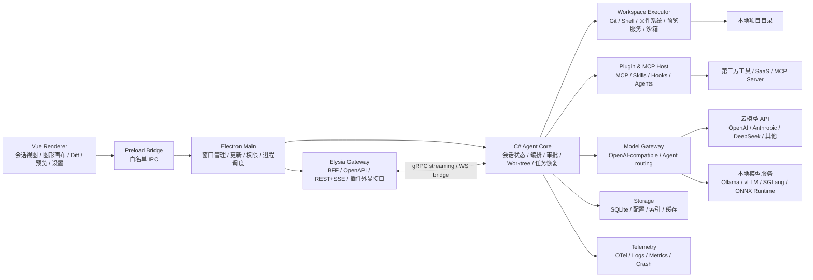

# 智能体图形化编程桌面客户端技术决策报告

## 执行摘要

你要做的不是一个“聊天框桌面壳”，而更接近一个**多会话、多工作树、可审批、可自动化、可扩展、可图形化编排的智能体工作台**。从公开资料看，OpenAI Codex App、Cursor 3、Claude Code Desktop、DeepSeek TUI、OpenCode 这五类产品，虽然形态不同，但已经在几个点上高度收敛：**并行会话/线程、隔离工作树、审批模式、自动化任务、插件与 MCP、以及“客户端壳 + 代理运行时”分层**。这意味着你的产品方向是对的，但如果只模仿它们的界面，而没有把“运行时内核”和“可视化编排层”设计清楚，最终很容易做成一个“更复杂的 AI IDE”，而不是“图形化智能体编程工具”。citeturn15view0turn12view1turn12view2turn13view1turn22view0

在你给定的约束下，**Electron + Vue 作为桌面壳、C# 作为主编排内核、Node.js 作为辅助、Elysia 作为中间层**，整体上是**可行**的；但前提是必须明确边界：**C# 只能有一个“主脑”，Node/Elysia 只能做薄 BFF/网关，不应再承担第二套状态机和代理编排职责**。如果 Node/Elysia 与 C# 同时维护会话状态、工具权限、模型路由、日志链路和插件生命周期，你会遇到最典型的失败模式：跨语言协议漂移、状态分裂、性能定位困难，以及维护成本持续上升。微软当前文档也表明，Semantic Kernel 与 Microsoft.Extensions.AI 适合做模型抽象和编排底座；同时，Microsoft Agent Framework 已被官方定位为 Semantic Kernel Agent Framework 与 AutoGen 的直接后继，因此在 Beta 阶段把它纳入评估是合理的，但不建议在 MVP 一开始就全量押注新框架。citeturn3search2turn3search8turn3search9turn3search13turn3search20

如果把目标收敛到“**先做出可用、好用、可扩的桌面代理工作台，再逐步做图形化编排**”，我给出的总建议是：**保留 Electron + Vue；保留 C# 为主体；保留 Elysia，但把它收缩到 API 网关与事件分发层；内部高频链路优先 gRPC/流式协议，外部插件/诊断链路用 REST + SSE/OpenAPI；MVP 优先远程模型与 OpenAI-compatible 服务接入，本地推理放到 Beta 作为可选扩展；插件体系以 MCP 为第一公民，但同时支持更高层的 skills/agents/hooks/plugins。** 这个方向既吸收了 Codex/OpenCode 的运行时分层，也吸收了 Cursor/Claude/DeepSeek 在审批、自动化、插件与多会话方面的经验。citeturn16search0turn22view0turn17view2turn18search1turn18search3turn14search2

下表给出面向技术决策者的压缩结论。

| 决策项 | 建议结论 | 理由 |
|---|---|---|
| 桌面壳 | **继续使用 Electron + Vue** | 交付速度快、生态成熟、与现有团队技能匹配；但要接受较高的基线内存和包体积。 |
| 代理内核 | **C# 单核编排** | 保持模型路由、工具调用、审批状态、会话记忆、遥测全部由 C# 统一维护。 |
| Node/Elysia | **保留，但薄化** | 建议只做本地 API 网关、事件桥、OpenAPI、前端友好中间层，不做第二套 orchestration。 |
| 视觉交互 | **双视图并存** | 一套“会话/线程视图”，一套“图形/节点视图”；不要只做画布，也不要只做聊天。 |
| 数据通道 | **内部 gRPC/流式；外部 REST+SSE** | 高频低延迟链路用严格 schema；调试与插件接入保留 OpenAPI 友好性。 |
| 插件能力 | **MCP 优先，插件高于工具** | 竞品已从“工具扩展”走向“skills/agents/hooks/plugins”组合扩展。 |
| 本地模型 | **Beta 再上** | 一上来做本地推理会把平台适配、性能、驱动、显存支持复杂度显著放大。 |
| Linux | **资源不足时放到 Beta** | 公开产品里 Codex 和 Claude Desktop 都未把 Linux 作为完整桌面优先级；若你的目标用户 Linux 占比高，则应反向提升优先级。 citeturn12view0turn12view1turn12view5 |

## 参考对象启示

这五个参考对象真正值得学的，不是“长得像谁”，而是它们分别代表了不同的产品能力重心：**Codex App 学 rich client 协议和线程化工作台，Cursor 3 学代理中心化工作空间，Claude Code Desktop 学桌面多面板与权限模式，DeepSeek TUI 学代理运行时与安全审批，OpenCode 学客户端/服务端分离与开放模型生态**。如果你的目标是“图形化智能体编程工具”，这五者都重要，但要明确一点：它们多数并不是“图形化节点编程器”，而是“代理工作台”。因此，你需要在吸收它们的同时，主动补上“图形画布层”的产品设计。citeturn15view0turn12view2turn12view1turn13view1turn22view0

| 参考对象 | 公开特征 | 最该学习的部分 | 不宜照搬的部分 | 对你产品的意义 | 资料 |
|---|---|---|---|---|---|
| OpenAI Codex App | 官方定义是“focused desktop experience”，强调并行 threads、worktree、automations、Git、review、terminal/actions、in-app browser、plugins、IDE sync；另有 app-server 作为 rich clients 接口。 | **客户端壳与运行时协议分离**、线程/项目/评审三栏结构、工作树隔离、自动化与插件接口。 | 过度绑定单一厂商体验；其 in-app browser 也明确不适合带登录态页面。 | 适合作为你“桌面代理中控台”的主参考。 | citeturn15view0turn16search0turn16search10turn16search16 |
| Cursor 3 | 明确把产品从 IDE 推向“unified workspace for building software with agents”；新界面从头围绕 agents 构建，支持多 repo、多环境、local/cloud/SSH、Design Mode、Agent Tabs、/worktree、/best-of-n、插件与 automations。 | **代理优先的桌面工作空间**、设计反馈闭环、并行代理、工作树批量实验。 | **不要在 MVP 走“fork VS Code”路线**；这会把维护成本推到极高。 | 适合作为“图形化工作流 + 并行代理编排”的行为参考。 | citeturn12view2turn12view3turn17view0turn17view2 |
| Claude Code Desktop | 官方支持多并行 sessions、diff/PR/CI、预览、终端、编辑器并排、多环境（本地/云/SSH）、权限模式、scheduled tasks、plugins、MCP。 | **桌面多面板布局**、权限模式、调试/预览/评审一体化。 | 其很多体验是“生产力工作台”，并不天然等于“图形化编排器”。 | 适合作为“桌面端可操作性与权限系统”的主参考。 | citeturn12view1turn18search0turn18search1turn18search2turn18search3 |
| DeepSeek TUI | 开源代理运行时，支持 Plan/Agent/YOLO 三模式、approval gates、sub-agents、HTTP/SSE runtime API、MCP、LSP、OS-level sandbox、持久任务队列、workspace rollback。 | **代理内核设计**、审批模型、子代理并发、运行时 API、沙箱设计。 | 它是 TUI 优先；不适合直接拿来做 GUI 交互范式。 | 最适合作为你“图形工具背后的 agent runtime”蓝本。 | citeturn13view1turn13view2turn13view3 |
| OpenCode | OpenCode Desktop/Beta 支持 Windows/macOS/Linux；其核心架构是 TUI/客户端 + 本地 server，server 暴露 OpenAPI 3.1、SSE 事件流；支持插件、MCP、本地模型、75+ provider、远程配置。 | **客户端/服务端解耦**、OpenAPI 规格输出、配置分层、MCP/插件和模型开放接入。 | 不要把“开放”做成“无限制”；其文档也提醒 MCP 会快速消耗上下文。 | 非常适合做你本地 runtime + GUI client 的直接架构参考。 | citeturn22view0turn22view1turn22view2turn22view3turn22view4turn22view5 |

这里有一个对产品定位非常关键的判断：**你的差异化不应是“再做一个 Codex/Claude/Cursor 的替代桌面端”，而应是把这些产品的“代理工作台能力”，映射为“图上的节点、边、子图、审批关卡、工具权限、模型路由、运行结果回放”。** 也就是说，画布不是装饰层，而是会话/线程/任务/工具调用等运行时对象的可视化表达层。这个层次，在上述公开产品里都还不是主战场，这正是你可以做出差异的地方。citeturn15view0turn12view1turn12view2

## 可行性评估与推荐架构

从纯技术角度看，你的混合方案是可落地的。Electron 天生就是 Chromium + Node.js 的组合，这给了你统一的桌面壳与 Node 能力；Elysia 可以生成 OpenAPI，也可以通过 Eden Treaty 做端到端类型安全，甚至在把 Elysia 实例直接传给 Treaty 时绕过网络请求，这一点对本地测试和轻量 BFF 非常有价值。另一方面，Semantic Kernel 与 Microsoft.Extensions.AI 已经形成了比较清晰的 .NET AI 抽象层，而 Microsoft Agent Framework 又正在成为多代理编排的新主线。也就是说，**“Electron/Vue 做壳 + C# 做脑 + Elysia 做桥”在能力上完全成立。**citeturn19search0turn4search0turn4search16turn4search12turn3search2turn3search8turn3search9

真正的问题不在“能不能”，而在“**怎么裁边界**”。Elysia 的官方文档明显更偏 Bun/WebSocket 生态，它有 Node adapter，但它的很多最佳实践、WebSocket 说明和性能心智仍然以 Bun 为中心；如果你本来就要在 Electron 中运行 Node，又同时引入一个 C# 主后端，那么 Elysia 的最佳位置应该是：**本地 API 网关、协议整形层、OpenAPI 输出层、前端友好聚合层**。不建议让它再承担“智能体编排、工具权限决策、会话记忆、模型路由、任务恢复”这类真正的后端核心职责。否则，这个中间层会从“桥”变成“第二个后端”。citeturn4search2turn4search17turn4search10turn4search16

更重要的是，参考对象里几乎都在走**客户端/服务端解耦**：Codex 有 app-server 以支撑 rich client、审批和流式事件；OpenCode 的 TUI 本质上就是 talking to local server，server 暴露 OpenAPI 3.1 和事件流；DeepSeek 也提供 `deepseek serve --http` 的 HTTP/SSE runtime API；Cursor 甚至把 Cloud Agents API 明确为 run-based REST API。对你来说，这说明**图形桌面只是外壳，真正长期可维护的核心，应该是一套可独立演进的代理运行时服务**。citeturn16search0turn22view0turn13view1turn1search17

### 推荐的系统架构



这张图背后的核心原则只有三条。第一，**Renderer 永远不要直接接触 Node/Electron 原语，也不要直接接触模型密钥和系统能力**；第二，**C# Agent Core 是唯一的“状态中枢”**；第三，**插件、MCP、本地模型、远程模型都应该成为可替换的适配层，而不是写死到业务逻辑里**。这套设计与 Codex/OpenCode/DeepSeek 暴露出来的运行时分层是同方向的。citeturn16search0turn22view0turn13view1

### 模块划分与接口定义

为保证后续扩展、测试、插件接入和跨语言演进，建议统一采用“一份公共事件信封 + 内外双协议”的方式：**内部高频链路使用 gRPC streaming；外部可观测与第三方对接使用 REST + SSE/OpenAPI；Renderer 到 Main 一律用白名单 IPC。**

统一事件信封建议如下。

```json
{
  "v": "1.1",
  "type": "agent.event.delta",
  "request_id": "req_xxx",
  "session_id": "sess_xxx",
  "trace_id": "trace_xxx",
  "seq": 42,
  "ts": "2026-05-18T10:15:30Z",
  "capabilities": ["tool.git", "tool.shell", "model.remote"],
  "payload": {},
  "error": null
}
```

| 模块 | 主要职责 | 建议接口 | 消息格式 | 认证 | 加密 | 错误码 | 版本兼容策略 |
|---|---|---|---|---|---|---|---|
| Vue Renderer | 会话、图形画布、Diff、预览、设置、日志回放 | `window.agent.*` 白名单 IPC | JSON envelope | 无直接凭证；仅依赖 Main 注入会话态 | 依赖 Electron 进程边界 | `UI_*`、`IPC_*` | 仅消费 capability，未知字段忽略 |
| Preload Bridge | ContextBridge 暴露最小 API | Electron `ipcRenderer.invoke/send` | 轻量 JSON | 仅允许调用受控 channel | 不处理持久密钥 | `IPC_DENIED` | IPC channel 语义版本化 |
| Electron Main | 窗口、菜单、权限、更新、进程拉起 | IPC / utilityProcess / 子进程管理 | JSON + 二进制句柄 | 启动期生成 `local_session_token` | 本地；敏感数据不落 Renderer | `APP_*`、`UPDATE_*` | `app_version` 与 sidecar `min_app_version` 双向校验 |
| Elysia Gateway | BFF、OpenAPI、聚合、SSE、外部调试入口 | REST + SSE + WebSocket（仅外显） | JSON envelope / OpenAPI | 本地随机端口 + 短期 Bearer；开发态可 Basic Auth，生产不建议 | 仅允许 loopback；远程场景 HTTPS/TLS | `API_*`、`AUTH_*` | URL 前缀 `/api/v1`; 新字段只增不删 |
| C# Agent Core | 会话状态、任务队列、审批、路由、图运行 | gRPC unary + streaming | Protobuf + event envelope | Main 签发短期 token；进程启动握手 | 本地 IPC 优先 loopback-only；远程走 TLS | `AGENT_*`、`MODEL_*`、`TOOL_*` | Protobuf additive-only；保留字段号；能力握手 |
| Workspace Executor | Git、Shell、FS、预览服务、浏览器/终端桥接 | gRPC tool calls / 本地命令执行 | Protobuf ToolRequest/ToolResult | Agent Core 授权 + workspace ACL | 子进程环境剥离；敏感参数不进日志 | `TOOL_SANDBOX`、`GIT_*`、`SHELL_*` | Tool schema 带 `tool_version` 与 `min_agent_version` |
| Plugin & MCP Host | MCP server、skills、hooks、agents、插件生命周期 | MCP / 本地插件 API / 事件钩子 | MCP 原生 + JSON manifest | 插件安装签名校验；运行期 capability allowlist | 远程 MCP 必须 HTTPS；本地插件受权限沙箱 | `PLUGIN_*`、`MCP_*` | Manifest 含 `schema_version`、`min_app_version` |
| Model Gateway | 云模型、本地模型、OpenAI-compatible 适配 | OpenAI-compatible / 自定义 adapter | Chat/Tool schema + stream chunks | Provider credential scope；按 workspace/组织隔离 | 对云模型强制 TLS；本地服务限制监听地址 | `MODEL_AUTH`、`MODEL_RATE_LIMIT`、`MODEL_CONTEXT_LIMIT` | provider adapter 独立 semver；模型能力动态发现 |
| Storage & Telemetry | SQLite、索引、缓存、OTel、结构化日志 | 本地 DB / OTLP / 文件日志 | JSON logs / metrics / traces | 读写权限分级 | 落盘敏感字段默认脱敏 | `STORE_*`、`OBS_*` | schema migration + 向后兼容读取 |

这里有几个特别值得强调的实现点。其一，**高频数据不要直接走 JSON 大对象**。微软的 gRPC 性能文档明确提醒，单条 `byte[]` 超过约 85,000 字节会进入 Large Object Heap，增加分配和 GC 压力，因此诸如大 diff、截图、日志片段、模型长流输出、代码索引快照，都应优先做**流式分块**，而不是一次性大包。其二，**Elysia 对外开放很合适，但不应作为内部唯一协议**；因为 OpenAPI 对调试友好，却不擅长承载严格的高频流事件。其三，**插件、MCP、模型 provider 都要走 capability discovery，而不是硬编码 UI 开关**。citeturn9search1turn4search0turn22view0turn14search2

### 替代方案对比

| 方案 | 优点 | 缺点 | 适用场景 | 结论 |
|---|---|---|---|---|
| **Electron + Vue + Elysia + C#** | 与当前偏好一致；前端效率高；C# AI 生态可直接利用；最容易在中短期做出完整桌面产品。 | 语言栈多；基线内存偏高；边界不清会形成双后端。 | 团队已有 JS/C#/桌面经验，目标是 6–9 个月内可交付。 | **当前最优** |
| **Electron + Vue + C#，去掉 Elysia** | 架构更干净；减少一层状态同步与打包复杂度。 | 前端 API 友好性、OpenAPI、插件外显接口需要自行补齐。 | 你更重视长期维护性，且能接受前端/后端直接围绕 gRPC 设计。 | **中长期更优，但 MVP 不一定更快** |
| **Tauri + Vue + C#** | Tauri 官方强调更小 bundle size、使用系统 WebView；更新签名链更强。 | 如果 C# 仍保留，再引入 Rust/Tauri 将形成新的跨语言复杂度；桌面壳变轻，但整体系统未必显著变简单。 | 包体积/冷启动是硬性 KPI，且团队能承担 Rust。 | **只有在明确卡在 Electron 体积/内存时再考虑** citeturn19search5turn19search8turn10search0turn10search1 |
| **Tauri + Vue + Rust Core，放弃 Node/C#** | 运行时最精简，桌面体验和包体积最优。 | 对现有偏好冲击最大；要重做 AI 编排和模型接入。 | 你准备重构团队技能结构，追求极致轻量。 | **不适合作为当前主线** |
| **全服务化桌面壳** | 与 OpenCode/Codex App server 模式一致；未来可接 Web/移动端。 | 首期开发量大；本地离线能力弱。 | Enterprise/团队协作优先。 | **适合 Beta 以后扩展** |

关于 IPC 与服务协议，我建议不要单选，而是**分层组合**：

| 协议 | 优点 | 缺点 | 推荐位置 |
|---|---|---|---|
| **gRPC streaming** | 强 schema、性能好、支持 deadline/cancel、适合多语言协议治理。 | 前端直连不友好；开发门槛高于 REST。 | **Elysia/Node ↔ C# 内部链路首选** citeturn9search0turn9search1turn9search4 |
| **WebSocket** | 流式自然、Elysia 支持好、便于 UI 实时事件。 | schema 漂移风险高；权限和重放处理麻烦。 | Gateway ↔ Renderer 的事件桥、插件调试链路 citeturn4search2turn4search11 |
| **REST + SSE / OpenAPI** | 文档清晰、调试方便、与 OpenCode/Codex 风格接近。 | 双向控制较弱，高频流不如 gRPC/WS。 | 外部诊断、插件 SDK、自动化 API、健康检查 citeturn22view0turn16search0 |

### 模型部署与接入方案对比

| 方案 | 优点 | 缺点 | 适用场景 |
|---|---|---|---|
| 远程云模型 API | 最快上线；无需考虑驱动、显存、模型管理。 | 成本可变；隐私与跨境合规压力更大。 | **MVP 首选** |
| OpenAI-compatible 服务化部署 | 与多数 coding-agent 生态兼容；便于多模型切换。 | 仍需维护服务可用性。 | 团队内部私有部署、网关统一 |
| Ollama 本地服务 | 部署简单；本地 HTTP API 易集成。 | 本地 `localhost` 默认无需认证；模型/性能能力有限且机器差异大。 | 个人开发者、本地 PoC、Beta 可选 citeturn20search0turn20search16 |
| vLLM 服务 | OpenAI-compatible，吞吐与服务能力强，文档也明确支持 gRPC。 | 更适合 GPU 服务器而不是桌面嵌入。 | 团队私有化、企业部署 citeturn20search1turn20search9 |
| SGLang 服务 | OpenAI-compatible，硬件覆盖广。 | 运维复杂度高于 Ollama。 | 高性能私有部署、结构化生成场景 citeturn20search2turn20search10 |
| ONNX Runtime 本地推理 | .NET/C#/Windows 集成友好；支持 on-device 生成；微软把它用于 Foundry Local、Windows ML、VS Code AI Toolkit。 | GenAI API 仍标注 preview；模型选择与生态不如服务化方案灵活。 | Windows 优先、本地小中模型、离线特性 citeturn3search3turn3search7turn3search15 |

如果把“上线概率”与“维护性”同时考虑，我建议你把模型接入分成三层：**远程 SaaS provider** 作为默认；**OpenAI-compatible 私有服务** 作为组织级接入；**本地 ONNX/Ollama** 作为增强包。不要在第一版就承诺“任何模型都能跑、任何机器都流畅”，因为这会把你的产品从“桌面工具”拖成“桌面 + 驱动 + 模型分发 + GPU 运维平台”。这不是一回事。citeturn22view4turn20search0turn20search1turn3search3

## 性能与部署评估

Electron 的优点是开发效率和生态，但代价也非常明确：Electron 把 Chromium 和 Node.js 一并打进应用二进制，这天然意味着更高的基线包体积和更高的驻留内存；Tauri 则利用系统 WebView，因此官方把“更小的 bundle size”当成核心卖点。对你这类**多进程、带终端、带 diff、带浏览器预览、带本地索引、可能带本地模型**的桌面 AI 工具来说，**性能瓶颈通常不是单一技术栈造成的，而是“桌面壳 + 多会话 + 索引/渲染 + Git 操作 + 模型流 + 插件上下文”共同叠加的结果。**citeturn19search0turn19search13turn11search0turn19search5

在没有实际代码库和目标硬件清单的前提下，下面给出的数值只能视作**工程估算**。它们的意义不是“精确预测”，而是帮助你在评审时提前设置 KPI、预算和限流策略。

### 性能、内存、CPU 与包体积估算

> 假设：不内嵌大模型权重；默认远程模型；同时存在 Electron Main、一个 Renderer、一个 Elysia 进程/utilityProcess、一个 C# Agent Core；项目规模中等；预览器与终端按需加载。  
> “未指定”的硬件条件按 2026 年常见开发机估算。

| 指标 | MVP 目标值 | 可接受上限 | 备注 |
|---|---:|---:|---|
| 冷启动可见窗口时间 | 2.0–3.5 秒 | 5 秒 | 首屏只加载项目列表、会话列表与最小壳，不预拉全量索引 |
| 空载总 RSS | 280–480 MB | 650 MB | Electron 壳 + Vue + Node 辅助 + C# Core |
| 打开单项目、单会话后 RSS | 420–700 MB | 900 MB | 含 diff/终端/少量文件树缓存 |
| 并行 5 会话后 RSS | 700 MB–1.4 GB | 1.8 GB | 需会话级惰性加载、日志裁剪、diff 虚拟化 |
| 空闲 CPU | < 3% | 8% | OTel、文件监控、心跳不能持续打满 |
| Git 大 diff 评审峰值 CPU | 1–2 核 40%–90% | 3 核持续高负载 | 峰值可接受，持续高负载不可接受 |
| 安装包下载体积 | 120–220 MB | 300 MB | Electron + Node + .NET 运行依赖 + 原生工具 |
| 安装后磁盘占用 | 250–600 MB | 900 MB | 与日志缓存、索引、插件、截图缓存有关 |
| 本地 ONNX/Ollama 小模型额外占用 | 2–8 GB RAM/VRAM | 视模型而定 | 本地模型应做成可选组件，不进入主包 |

上表的估算逻辑，主要来自你当前栈本身的结构特征：Electron 自带 Chromium/Node；性能优化官方重点也放在减少内存、CPU 和磁盘使用上；同时，你又准备把 Node/Elysia 与 C# 双侧常驻化，因此只要不严控进程数、缓存、日志、预览与图形层的惰性加载，很容易把“基线负担”做高。citeturn19search0turn11search0turn10search10

### 性能基准与测试建议

Playwright 官方提供了 Electron 自动化支持；BenchmarkDotNet 适合做可重复的 .NET 微基准；k6 已支持 WebSocket 负载测试；OpenTelemetry .NET 提供 traces、metrics、logs 的统一采集能力。建议你在项目最初期就把这些工具纳入仓库，而不是等性能问题出现后再补。citeturn8search0turn8search1turn8search2turn8search3

| 测试主题 | 典型用例 | 关键指标 | 推荐工具 | 数据采集方法 | 建议门槛 |
|---|---|---|---|---|---|
| 启动性能 | 首次启动、二次启动、带最近项目恢复 | TTFW、TTI、首屏 JS heap | Playwright(Electron) + 自定义计时点 | main/preload/renderer 埋点 + trace_id | TTFW < 3.5s |
| UI 渲染 | 1k/5k 节点图、长 diff、文件树展开 | FPS、长任务数、GC 次数 | Playwright + Chromium Performance | renderer Performance API + OTel | 长任务 < 50ms |
| C# 编排内核 | 工具路由、上下文裁剪、会话恢复、审批判定 | 平均延迟、P95、分配量、GC | BenchmarkDotNet | benchmark artifact + CI 比对 | P95 稳定，分配量可追踪 |
| 流式事件 | agent.delta、log tail、partial diff | 首 token 时间、吞吐、乱序率 | k6 WebSocket / 自制 gRPC 压测 | seq 校验 + trace/span | 首 token < 800ms（远程模型除外） |
| Git 工作树 | 创建 worktree、切换分支、大仓库 diff | 操作耗时、失败率、磁盘占用 | shell benchmark + OTel | CLI stderr/stdout 结构化记录 | worktree 创建 < 5s |
| 文件/索引 | 10k/50k 文件项目加载、排除规则变更 | 扫描耗时、watcher 数、RSS | 自研场景脚本 + OTel | 索引阶段 span + OS 文件事件统计 | 增量索引明显优于全量 |
| 插件/MCP | 同时启用 5/10 个 MCP、失败恢复 | token 增幅、调用耗时、上下文爆炸率 | 集成测试 + 费用统计 | 每次提示记录 token 预算 | 默认启用数上限 |
| 自动更新 | 检查、下载、回滚、签名失败 | 成功率、恢复时间、误报率 | CI 发布流水线 + 集成测试 | staged rollout 指标 + 提前签名校验 | 灰度失败可回滚 |

在基准设计上，最重要的经验不是“测得多全”，而是**把用户真正会遇到的路径测对**。对于你的产品，最关键的不是 LLM TPS，而是：**打开项目是否慢、切换会话是否卡、大 diff 是否炸、并行会话是否拖垮内存、插件/MCP 是否让上下文成本失控。** OpenCode 甚至直接在文档里提醒，MCP 会显著增加上下文，尤其像 GitHub MCP 这类服务很容易把 token 推到上限；DeepSeek 也把 1M token context、prefix-cache 稳定性、sub-agent 并发上限这些能力显式暴露出来。这说明“上下文预算管理”本身就应当成为一个指标维度。citeturn22view5turn13view1turn13view2

### 打包、发布与自动更新

在打包分发层，Electron 生态里 Electron Forge 与 electron-builder 都能完成任务。Forge 官方强调它是一体化构建工具，包含签名、安装器与 artifact 发布；而 electron-builder 的自动更新文档和生态成熟度对桌面应用更直接，尤其适合你这种需要“签名 + 发布 + 更新”的产品。我的建议是：**若团队更重“工程集成清晰”，可选 Forge；若更重“更新链路成熟与生态资料”，可选 electron-builder。**citeturn21search10turn21search2turn21search6turn2search2

跨平台差异方面，建议如下表处理：

| 平台 | 建议打包格式 | 关键差异 | 自动更新建议 |
|---|---|---|---|
| Windows | NSIS `.exe` | 需考虑系统 Git、PowerShell、路径长度、企业代理环境；如有 ARM64 需求需单独验证。 | 分 channel 灰度；签名证书提前准备；回滚保留最近两版 |
| macOS | `.dmg` / `.zip` | 必须做 code signing，并且面向 Mac App Store 外分发时需要 notarization。 | 更新包必须签名；CI 中完成 notarize+staple |
| Linux | `.AppImage` + `.deb/.rpm` | 发行版碎片化明显；桌面集成、keyring、shell、包管理器行为差异大。 | AppImage 适合快速覆盖；企业用户更偏 `.deb/.rpm`；Linux 先 Beta |

macOS 这一点必须单独强调。Electron 官方要求分发应用进行 code signing，并说明 packager API 可同时进行 signing 与 notarization；Apple 方面也明确，自 macOS 10.15 起，采用 Developer ID 在 Mac App Store 外分发的软件需要 notarization。也就是说，**如果你把 macOS 作为正式支持平台，签名与公证不是“优化项”，而是发布链路的组成部分。**citeturn2search1turn27search9turn27search2turn27search6

Windows 与 Linux 也有一点非常现实：**开发类桌面工具往往隐含依赖 Git、shell、POSIX 工具链或终端语义。** Claude Code Desktop 在 Windows 首次使用时要求安装 Git for Windows；OpenCode 则明确在 Windows 上推荐用 WSL，以获得更好的文件系统性能、终端支持和工具兼容性。这说明如果你的工具运行大量 shell/Git/patch/grep/dev-server 流程，你不能假设“Windows 和 Linux 体验天然等价”。建议在第一版就内置 `doctor`，显式检查 Git、shell、Node/C# runtime、浏览器预览依赖、代理与证书状态。citeturn12view1turn14search18

## 安全与合规

Electron 安全是这类产品的高风险区。官方安全指南明确给出的底线包括：启用 contextIsolation、保持 renderer sandbox、不要启用 nodeIntegration、不要对不可信内容使用 `shell.openExternal`。另外，Electron 官方还提醒你，发布产品时你实际上也在发布 Electron、Chromium 和 Node.js 的组合包，因此版本更新本身就是安全问题的一部分。对于你的产品，这意味着 UI 层一旦混入不可信网页、插件内容、MCP 返回结果、浏览器预览或第三方文档，就必须严格限制它接触系统能力的方式。citeturn2search0turn2search19turn26search18turn19search13

具体到功能设计，我建议采用下面这套原则。Renderer 只拿到最小白名单 API；所有系统调用都通过 preload + main + agent core 间接完成；`shell.openExternal` 绝不接受模型生成或外部内容直接拼接的 URL；内嵌浏览器预览只用于不带登录态的内容。Codex 官方甚至明确说明 in-app browser 不支持认证流、签名态页面、浏览器扩展和现有 cookies，并提醒把页面内容当作不可信上下文；Electron 官方也对 `<webview>` 的稳定性提出了警告。因此，你应当把“认证页面、生产系统页面、第三方 SaaS 后台”等高风险流程默认放到系统浏览器中，而不是在内嵌预览器里执行。citeturn16search10turn19search21turn26search18

桌面 AI 工具的第二个安全焦点是**工具权限与沙箱**。DeepSeek TUI 给出的 Plan / Agent / YOLO 三模式，是很值得借鉴的；Claude Code 则把 permission mode 与 `/permissions` 做成了显式系统；Codex 也把 approvals、安全和结构化日志独立成管理能力。对你的产品来说，建议最少提供三档：**观察模式**（只读 / 不写文件 / 不执行 shell）、**审批模式**（默认 ask）、**可信模式**（限定工作区内自动执行）。不要把“自动执行一切”做成默认值。citeturn13view1turn18search2turn18search10turn16search16

密钥管理上，参考对象里有可以学的，也有不该学的。DeepSeek README 说明 API key 可保存在 `~/.deepseek/config.toml`；OpenCode 说明 provider API keys 存在 `~/.local/share/opencode/auth.json`；它们对开源 CLI/TUI 很实用，但对你这个**面向企业和图形桌面的产品**不够稳妥。更合适的方案是：短期凭证放 OS 提供的安全存储或由 Electron `safeStorage` 做包裹加密；长效凭证尽量进入系统凭据库，由 C# 服务统一调用。这样可以显著降低“明文配置文件被误上传、被同步盘拷走、被本地恶意软件直接扫到”的风险。citeturn13view2turn22view4turn26search0

### 认证、加密与日志脱敏建议

| 主题 | 建议 |
|---|---|
| 本地服务认证 | 采用启动期生成的短期 Bearer token；只绑定 loopback；token 只在 Main 与 sidecar 进程间传递 |
| 远程服务认证 | OAuth / API Key / 组织 token；按 workspace、provider、组织边界隔离 |
| 传输加密 | 本地进程间默认 loopback-only；所有远程模型、MCP、组织配置、更新清单走 TLS |
| 落盘加密 | 凭证与 refresh token 使用系统安全存储；缓存内容至少做 envelope encryption |
| 日志策略 | 默认结构化日志；prompt、代码、命令输出、路径、环境变量默认脱敏；仅在显式调试模式下提高详细度 |
| 插件权限 | manifest 声明能力；首次启用授权；细粒度撤销；安装时校验签名与来源 |
| 会话分享 | 导出前二次提示；默认移除密钥、邮箱、令牌、路径、浏览器 cookie 提示 |

Codex 的一个很值得抄的模式，是它在 OTel 导出默认关闭的同时，仍然能在开启后发出结构化事件，并且默认把 user prompt 内容做 redaction，日志事件里保留 run、tool、stream、approval 等关键运行态。这个取舍非常适合桌面工具：**先保证本地自洽，再按需开启观测；开启观测时默认脱敏，而不是默认全量。**citeturn16search5turn16search16

### 数据隐私与合规控制

你的产品在 PIPL/GDPR 视角下的敏感点，主要不是“普通使用日志”，而是**代码片段、终端输出、文件路径、浏览器预览、截图、审阅评论、MCP 拉取的第三方数据、以及把这些内容发送到境外模型服务的行为**。这很容易同时触发最小必要、敏感信息处理、自动化决策、跨境传输、日志保留和影响评估等问题。citeturn23view0turn23view2turn23view3turn23view4turn25search15turn25search1turn25search2

| 合规主题 | 设计控制 | 适用说明 | 法规依据 |
|---|---|---|---|
| 最小必要与目的限定 | 默认关闭“上传全部代码库”；只在用户选择的项目/目录内工作；MCP 按需启用；日志最小化 | PIPL 要求明确、合理目的与最小范围；GDPR 也要求目的限定与最小化 | citeturn23view0turn5search13 |
| 处理依据与告知 | 首次接入云模型、远程插件、企业配置时做清晰告知；区分“本地处理”与“发送到云端” | PIPL 第十三条与第十七条强调处理依据和告知；GDPR 要求 lawful/fair/transparent | citeturn23view1turn5search1 |
| 敏感信息处理 | 对 API key、终端密钥、浏览器 Cookie、个人邮箱、截图等设敏感级别；发送前提示与遮罩 | PIPL 对敏感个人信息要求特定目的、必要性与单独同意 | citeturn23view2 |
| 自动化与评估 | 对自动执行工具、自动提交 PR、自动打开外部页面等做权限档位与审计记录 | PIPL 明确自动化决策、跨境提供等场景需事前影响评估；GDPR 高风险新技术处理需 DPIA | citeturn23view4turn25search2 |
| 安全措施 | 加密、去标识化、权限分级、培训、应急预案、审计日志 | PIPL 第五十一条明确要求安全技术和管理措施；GDPR 第三十二条强调安全性 | citeturn23view4turn25search1 |
| 跨境传输 | 为境外模型/API 单独标识；企业版支持境内网关、中转脱敏、地域路由；必要时准备标准合同/评估 | PIPL 第三十八、三十九条规定跨境条件与单独同意；GDPR 第四十四条及 SCC 适用于第三国传输 | citeturn23view3turn7search1turn25search3 |
| 2024 中国规则调整 | 可结合业务判断是否落入豁免，如未触及重要数据、特定合同履行等场景，但不得把豁免理解为“全面放开” | 中国 2024 年规则对部分出境义务做了收窄与豁免；仍需个案判断 | citeturn6search2turn6search6 |
| AI/LLM 风险管理 | 建立模型输出与训练/记忆风险评估、提示注入隔离、用户数据保留策略 | EDPB 与 CNIL 已对 LLM/AI 开发中的隐私风险给出方法论和建议 | citeturn7search2turn7search3turn7search10 |

对中国市场尤其要明确一点：如果你的产品允许把代码、日志、截图、客户工单、数据库片段通过 MCP 或模型 API 发送到境外服务，**“代码不是个人信息”这个直觉经常不成立**。终端输出、路径、邮箱、工单内容、监控日志、聊天上下文里都可能混有个人信息甚至敏感信息。因此，企业版必须从一开始就提供**地域开关、供应商名单、可观测的出境路径、合规导出报表和数据删除机制**。这不是后装功能。citeturn23view2turn23view3turn23view4turn6search2

## 开发计划与风险缓解

### 开发里程碑与时间估算

以下时间假设团队对 Electron/Vue/C#/.NET 有中等以上经验，且“图形化画布”是产品差异化但不是首版唯一入口。若团队对桌面签名、公证、更新、MCP、C# AI 栈都较陌生，应额外预留 4–6 周的基础设施缓冲。

| 阶段 | 时间估算 | 建议人员配置 | 关键任务 | 阶段退出标准 |
|---|---:|---|---|---|
| MVP | 10–12 周 | 2 前端/Electron、2 C#、1 Node/Elysia、1 QA、0.5 DevOps、0.5 设计/PM | 桌面壳、会话列表、单项目单工作区、C# Agent Core、远程模型接入、终端/文件/diff、审批模式、日志链路、Win/mac 打包 | 能稳定完成单项目编码、diff review、命令执行、MCP 基础接入 |
| Beta | 8–10 周 | 2 前端、3 C#、1 Node、1 QA 自动化、1 DevOps/SRE、1 产品/设计 | 图形画布 v1、worktree、多会话并行、自动化调度、插件 SDK、策略控制、企业配置、崩溃收集、性能优化 | 支持并行 3–5 会话、图形编排、灰度更新、回滚、组织配置 |
| 正式版 | 8–12 周 | 2 前端、3 C#、1 Node、1 QA、1 DevOps、1 技术写作/支持 | Linux 支持、权限中心、PIPL/GDPR 功能完备、可视化审计、远程/SSH 环境、可选本地模型、插件市场基础 | 达到发布级稳定性；文档、升级、合规、观测、回滚链路完整 |

如果人力更紧，建议明确取舍：**MVP 不做本地大模型、不做 Linux 正式支持、不做开放插件市场、不做“类 VS Code 全量编辑器 fork”，只做最核心的“项目 + 会话 + worktree + diff + terminal + 审批 + 远程模型 + MCP 基础”。** 这是最能控制风险的范围。citeturn15view0turn12view2turn18search0turn22view0

### 风险清单与缓解措施

| 风险 | 概率 | 影响 | 排序 | 说明 | 缓解措施 |
|---|---|---|---:|---|---|
| Node/Elysia 与 C# 双编排导致状态分裂 | 高 | 高 | 1 | 两边同时维护 session/task/permission/model state 最危险 | 明确 C# 单核编排；Elysia 只做网关；状态只在一处落盘 |
| 插件/MCP 引入数据泄露与 prompt injection | 高 | 高 | 2 | 所有竞品都在扩 MCP/插件，但这会扩大上下文与风险面 | capability allowlist、MCP 分级、上下文预算、审计与禁用开关 |
| Electron 安全边界失守 | 高 | 高 | 3 | preload 过宽、openExternal 滥用、内嵌不可信页面是高危项 | contextIsolation、sandbox、nodeIntegration=false、URL allowlist |
| Windows/macOS/Linux 工具链不一致 | 高 | 高 | 4 | Git、shell、文件监听、路径、keychain 行为差异显著 | 内置 `doctor`；系统 Git 依赖显式化；Windows 提供 WSL/PowerShell 双策略 |
| 打包、签名、公证、自动更新失败 | 中高 | 高 | 5 | 尤其 macOS 可发布性对签名和 notarization 高度敏感 | 从第一个迭代就接入签名流水线；分平台 runner；预发布烟测 |
| 包体积与驻留内存过大导致采用率下降 | 中高 | 高 | 6 | Electron 基线高，再叠加 Node+C# 常驻更容易失控 | 进程数最小化、按需加载、日志裁剪、预览懒加载、压缩资源 |
| 本地模型支持范围过宽 | 中高 | 高 | 7 | GPU/驱动/显存兼容性会吞噬大量支持成本 | 本地模型 Beta 化；列支持矩阵；远程模型为默认 |
| 跨语言协议漂移与版本兼容问题 | 中 | 高 | 8 | JSON 自由发展最容易失控 | 内部协议 protobuf 化；SemVer；capability handshake；合约测试 |
| 日志与观测和隐私合规冲突 | 中 | 高 | 9 | 桌面 AI 工具日志极易包含代码和个人信息 | 默认脱敏、按租户/环境策略控制、导出开关、保留期管理 |
| 图形画布过早过重，拖慢核心能力交付 | 中 | 中高 | 10 | 画布很容易变成复杂前端工程黑洞 | 先实现运行时，画布只可视化关键对象；复杂编排放 Beta |

### 推荐的第三方库、框架、CI/CD 与发布方案

下表并不是“唯一解”，而是**在你当前栈偏好下，最均衡的一组选择**。

| 层级 | 推荐 | 说明 |
|---|---|---|
| 前端 UI | Vue 3、Vite、Pinia、Vue Router、VueUse | 贴合现有偏好，开发效率高 |
| 图形画布 | Vue Flow + 自动布局引擎 | 适合做节点/边/分组/状态可视化 |
| 代码与 Diff | Monaco Editor、Monaco Diff | 不要在 MVP fork VS Code |
| 终端 | xterm.js | 桌面开发工具标配 |
| Electron 工程 | Electron Forge **或** electron-builder；开发时可配 electron-vite | Forge 一体化强；builder 在更新链路资料更多 |
| Electron 安全 | preload 最小 API、`safeStorage`、白名单协议控制 | 先把“不能做什么”定清楚 |
| Node/BFF | Elysia、`@elysia/openapi`、`@elysia/eden`、`@elysiajs/node` | 保留 Elysia 的 API 友好性，但收缩职责 |
| C# 内核 | .NET、Microsoft.Extensions.AI、Semantic Kernel；Beta 评估 Microsoft Agent Framework | MVP 稳，Beta 再评估新框架 |
| 通信 | gRPC（内部）、REST+SSE（外部）、WebSocket（UI 事件桥） | 三层分工明确 |
| 存储 | SQLite（会话、索引、缓存元数据）、本地文件（大对象与 artifact） | 跨平台、易备份、易升级 |
| 观测 | OpenTelemetry、Serilog、OTLP Collector；前端配崩溃收集 | 桌面壳与 C# 服务统一 trace_id |
| 测试 | Vitest、Playwright(Electron)、BenchmarkDotNet、k6 | 单元、E2E、微基准、流式压力分层覆盖 |
| 模型接入 | OpenAI-compatible adapter；Ollama、vLLM、SGLang、ONNX Runtime 适配器 | 先统一接口，再谈 provider |
| CI/CD | GitHub Actions matrix + OIDC；macOS 专用 runner；制品签名与公证流水线 | matrix 与 OIDC 都有官方支持 citeturn21search16turn21search1 |
| Monorepo | pnpm workspace | 适合 Electron/Node/共享 TS SDK 管理 citeturn21search3turn21search11 |
| 容器化 | Docker Compose 用于本地模型服务、私有网关、联调环境；不建议把桌面 GUI 容器化 | Compose 适合多服务开发栈管理 citeturn20search15turn9search2 |

### 优先参考的官方、学术与社区来源

| 优先级 | 类型 | 应重点跟踪的来源 |
|---|---|---|
| 最高 | 官方产品/框架文档 | OpenAI Codex App / app-server / security / config；Claude Code Desktop / permissions / plugins / MCP；Cursor blog/changelog/docs；OpenCode docs；DeepSeek TUI GitHub README/docs |
| 最高 | 官方底层技术文档 | Electron 官方 security / performance / process-model / code-signing；Microsoft Learn 上的 Semantic Kernel、Microsoft.Extensions.AI、Agent Framework、AI Evaluation、ONNX Runtime；Tauri 官方 architecture / updater / signing |
| 最高 | 法规官方原文 | 中国网信网 / 中国人大网的 PIPL、数据出境安全评估办法、个人信息出境标准合同办法、促进和规范数据跨境流动规定；EUR-Lex / European Commission 的 GDPR 与 SCC |
| 中高 | 官方标准/监管建议 | MCP 官方文档、EDPB LLM 隐私风险报告、CNIL AI/GDPR 建议 |
| 中 | 官方工程生态 | Playwright、BenchmarkDotNet、OpenTelemetry、GitHub Actions、pnpm、Electron Forge / electron-builder |
| 中 | 中文/本地化解读 | 法规优先看中文官方；工程问题可补充中文社区文章，但**以官方文档为准** |

综合来看，**最值得立刻开始的路线**不是再去论证“Electron 还是 Tauri”，而是先把你的产品分成三层：**桌面壳、运行时、图形编排层**。只要你把这三层划清楚，Electron 的劣势主要是“基线资源更高”；但如果你划不清，哪怕换成 Tauri，复杂度也只会换个地方爆发。相反，如果你在 MVP 阶段就做到“C# 单核编排、Elysia 薄网关、gRPC 内核协议、MCP 优先扩展、严格权限模式、Win/mac 可发布链路打通”，这个项目是完全有机会在中期做成一个有明显差异化的产品的。citeturn19search0turn19search5turn3search2turn16search0turn22view0

## 开放问题与资料边界

有几项信息在公开资料中并不完整，因此本报告对它们做了保守处理。其一，Cursor、Claude、Codex 的**内部实现细节**并未完全公开，本文主要依据官方对外暴露的功能、协议和产品边界来推导架构启示，而不是依据其私有代码实现。其二，**“DeepSeek TUI 非终端版”**未发现官方的独立图形版公开文档，因此本报告把它定位为**运行时参考对象**而非 GUI 参考对象。其三，关于**本地模型性能**、**真实安装包体积**和**多平台资源占用**，本文给的是工程估算而不是实测结论；正式立项后，应尽快用 2–3 套代表性机器做基线测量，并把测量结果回灌为发布门槛。citeturn13view1turn12view2turn12view1turn16search0